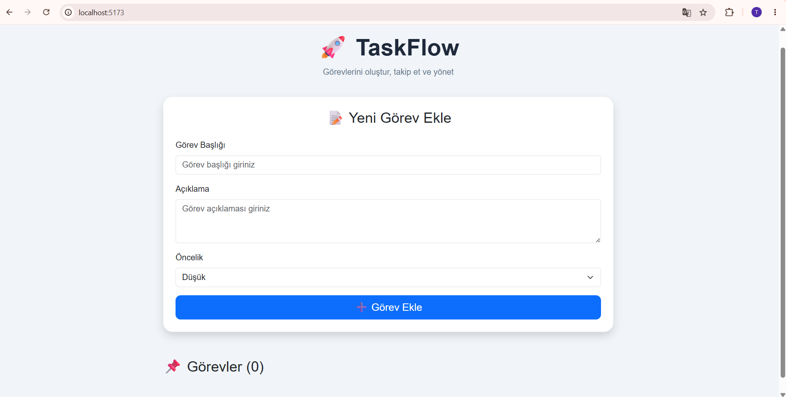
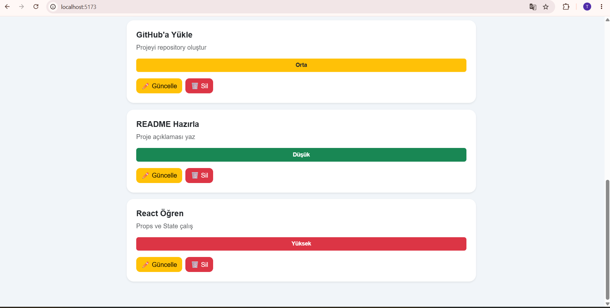
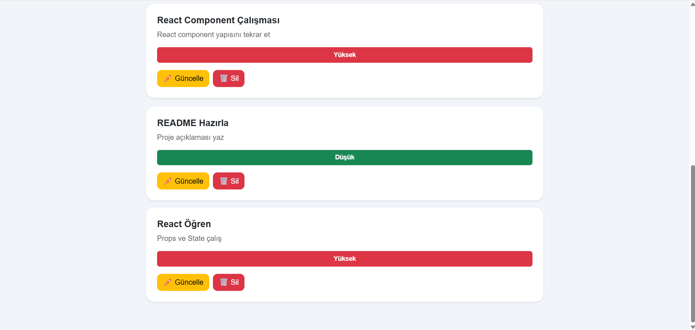
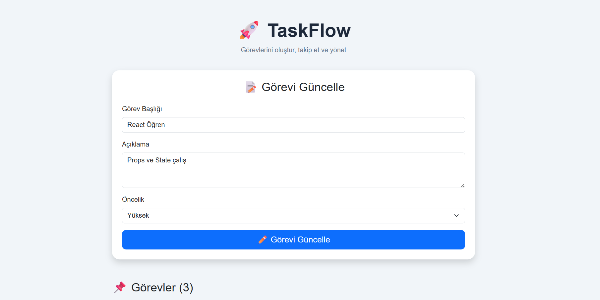

# 🚀 TaskFlow - Görev Yönetim Uygulaması


## 📌 Proje Hakkında

TaskFlow, kullanıcıların günlük görevlerini kolayca oluşturabileceği, listeleyebileceği, güncelleyebileceği ve silebileceği modern bir görev yönetim uygulamasıdır.

Bu proje, Web Geliştirme JavaScript eğitimi kapsamında React kullanılarak geliştirilmiştir.


## 🎯 Proje Amacı

React temel kavramlarını uygulamak:

- Component yapısı
- State yönetimi
- Props kullanımı
- CRUD işlemleri
- LocalStorage kullanımı


## 🛠 Kullanılan Teknolojiler

- ReactJS
- Vite
- JavaScript
- Bootstrap 5
- CSS
- LocalStorage


## ✨ Özellikler

### ✅ Görev Ekleme

Kullanıcı yeni görev oluşturabilir.

Görev bilgileri:

- Görev başlığı
- Açıklama
- Öncelik seviyesi


### 📋 Görev Listeleme

Oluşturulan görevler kullanıcıya listelenir.


### ✏️ Görev Güncelleme

Kullanıcı daha önce oluşturduğu görevleri düzenleyebilir.


### 🗑️ Görev Silme

İstenmeyen görevler silinebilir.


### 💾 LocalStorage

Görev verileri tarayıcı hafızasında saklanır.

Sayfa yenilense bile görevler korunur.


## 📂 Proje Yapısı
src
│
├── components
│ ├── TaskForm.jsx
│ └── TaskList.jsx
│
├── App.jsx
├── main.jsx
└── index.css


## ⚙️ Kurulum

Projeyi klonlayın:

```bash
git clone proje-linki
```

Proje klasörüne girin:

```bash
cd taskflow-react
```

Paketleri yükleyin:

```bash
npm install
```

Projeyi çalıştırın:

```bash
npm run dev
```

## 📸 Proje Görüntüleri


### Ana Ekran




### Görev Listeleme



### Görev Silme




### Görev Güncelleme



## 🚀 Canlı Demo

Proje Netlify üzerinde yayınlandıktan sonra bağlantı eklenecektir.

## 👨‍💻 Geliştirici

Tekin Mert Ataman

Web Geliştirme JavaScript Projesi